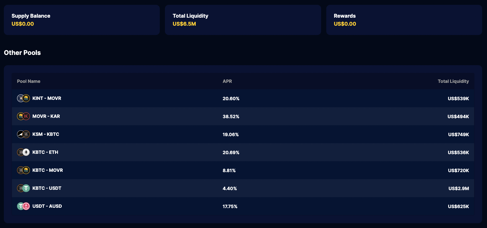
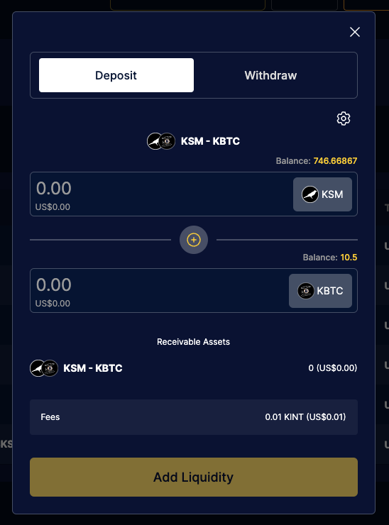
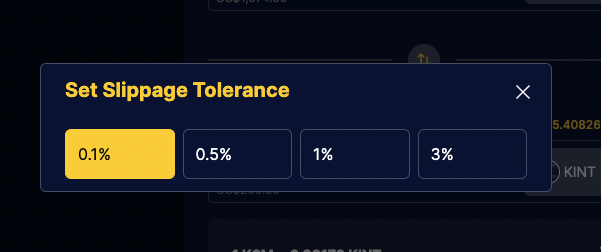
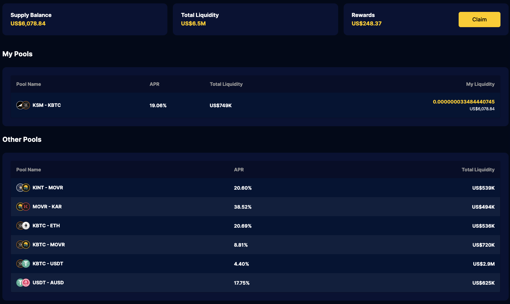

# Pool

Decentralized trading is only possible due to people who willing to provide liquidity. This liquidity is held by a liquidity pool.

## Prerequisites

Make sure you have a compatible [wallet plugin](guides/wallets-explorers.md#substrate-wallets) installed.

## Pools

At the end of this guide you will have:

- [x] [Deposited liquidity into a pool](#3-deposit-into-liquidity-pool)
- [x] [Withdrawn from liquidity pool](#4-withdraw-from-liquidity-poll)

### 1. Go to the swap page

<!-- tabs:start -->

#### **Interlay**

Coming soon!

#### **Kintsugi**

Coming soon!

#### **Testnet-Kintsugi**

[kintnet.interlay.io/swap](https://kintnet.interlay.io/swap)

#### **Testnet-Interlay**

[testnet.interlay.io/swap](https://testnet.interlay.io/swap)

<!-- tabs:end -->

### 2. Bring tokens for pools and transaction fees

You will need some tokens to pay for transaction fees (KINT on Kintsugi, INTR on Interlay). Additionally, you also need tokens to be able to swap for another token.

<!-- tabs:start -->

#### **Interlay**

A list of exchanges with INTR listings can be found on [Coingecko](https://www.coingecko.com/en/coins/interlay). Those exchanges should also have the assets in the Interlay lending markets listed.

#### **Kintsugi**

A list of exchanges with KINT listings can be found on [Coingecko](https://www.coingecko.com/en/coins/kintsugi). Those exchanges should also have the assets in the Kintsugi lending markets listed.

#### **Testnet**

On testnet, you can obtain some tokens (KINT/INTR, KBTC/IBTC, KSM/DOT, USDT) by clicking on the "Tokens Faucet" button on the right-hand side of the top bar.

<!-- tabs:end -->

### 3. Deposit into Liquidity Pool

Start by selecting the pool that you would like to provide liquidity into.

After selecting a pool, you will be presented with two tabs: deposit and withdraw. Looking into depositing into the liquidity pool, you will see a input for each asset of the pool. Each has to consist of at least two assets.

When you input the token amount, the amounts for the rest will be calculated. Because assets in this pool are in a specific ratio that needs to be preserved Along side the amounts changes, you can see how much of LP token you will receive (i.e KSM-KBTC LP Token).

At this stage, you are ready to deposit liquidity, but before procceding, there are couple of things that might be of your interest to config or beware of:

#### Slippage

You can access the current slippage and chang it by pressing the top right cog element, which will open a modal where you can customize your slippage.

You can visit this [documentation](https://support.uniswap.org/hc/en-us/articles/8643879653261-What-is-Price-Slippage-) for a more in-depth explanation about this topic.

You will be able to see your provided liquidity in the **My Pools** table.

### 4. Withdraw from Liquidity Pool

Select a pool from the **My Pools** table and navigate to the **Withdraw** tab.

Input the amount of LP Tokens that you would like to withdraw, which will be deducted from your account and you will receive the amount of tokens presented in the **Receivable Assets** section (make sure you have the desired slippage).
