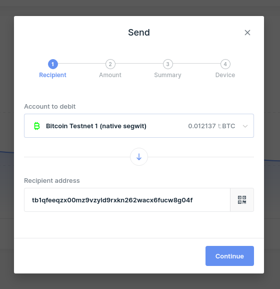
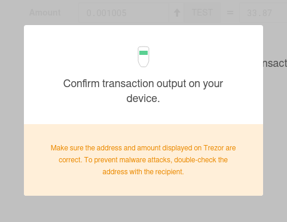

# Issue interBTC

interBTC allows you to receive a representation of BTC to be used any way you see fit in the Polkadot ecosystem.
To get you started, follow this guide.

At the end of this guide you will have:

- [x] Locked BTC with a collateralized Vault
- [x] Issued your first interBTC on the interBTC app

## Video Guide

<iframe width="560" height="315" src="https://www.youtube.com/embed/hMZTj6ctGQE" frameborder="0" allow="accelerometer; autoplay; clipboard-write; encrypted-media; gyroscope; picture-in-picture" allowfullscreen></iframe>

## Prerequisites

Make sure you have the required [polkadot-js extension and a Bitcoin wallet](start/prereq.md).

## Issue interBTC

### 1. Go to [ beta.polkabtc.io](https://beta.polkabtc.io)

The app has 3 tabs: Issue, Redeem, and Transfer. Ensure you are on the Issue tab.

### 2. Enter the amount of interBTC you want to issue in the app

?> Don't forget to get some testnet DOT via the faucet ("Request DOT" button, right-hand side of top bar) before making an issue request. You will need this to pay for the bridge transaction fees.

Enter the amount of interBTC you want to issue. The app will automatically select a vault for you.

Check the details of your issue request and click **"Confirm"**. Sign the transaction via the `polkadot-js` extension when asked and wait a few moments.

You should be able to see your request in the **"Issue Requests"** table below the app modal. Clicking on a row of this table will open a pop-up with more details about the request.

### 3. Transfer BTC from your Bitcoin wallet to the given address

Use your Bitcoin wallet to transfer the specified `amount` to the given `address`.

?> This final amount includes a small system fee on top of the original amount specified.

<b>Send BTC with the Ledger wallet</b>

To configure [Ledger Live](https://www.ledger.com/ledger-live) to work with Bitcoin testnet, go to `Setting` > `Experimental features` and enable `Developer mode`. Using the `Manager`, install the `Bitcoin testnet` app onto your device.

Enter the recipient address or scan the QR code. ([Support](https://support.ledger.com/hc/en-us/articles/360019123593-Send-crypto-assets))

Enter the amount - this may be auto-completed.

Review the summary and click **"Continue"**.

Confirm the recipient address, amount and fees on the device.

The receipt will show the transaction ID, click **"View in explorer"** to check whether your transaction is included in the Bitcoin network.

<b>Send BTC with the Trezor wallet</b>

To configure the [Trezor Wallet](https://wallet.trezor.io/#/) to work with Bitcoin testnet, go to the `Wallet Settings` and set `Backend Server URL` to `https://tbtc2.trezor.io`.

For up-to-date details please checkout the [Trezor Wiki](https://wiki.trezor.io/Bitcoin_testnet).

Enter the recipient address and amount manually or scan the QR code. ([User Manual](https://wiki.trezor.io/User_manual:Making_payments#Enter_the_destination_address_and_the_amount))

Confirm the recipient address, amount and fees on the device.

The payment will appear in the `Transactions` tab as unconfirmed. Once this is included in the Bitcoin network the status should update.
If configured, you may also check the status of the transaction in a block explorer.

### 4. Confirm your BTC transaction

Once the payment has been sent, the app will automatically locate your transaction on the Bitcoin blockchain. If this transaction is correct, you can just wait for a few minutes and you will receive your interBTC. This is because a vault will eventually execute your request if your transaction has sufficient confirmations.

You can check the status of your issue request in the **"Issue Requests"** table below the app modal. If your Bitcoin transaction has enough confirmations but has not been executed by a vault yet, an **"Execute"** button will be displayed in the table. To finalize the Issue process and claim your interBTC, either wait for a vault to auto-execute your request, or click **"Execute"** yourself.

### 5. Check your historical requests

If you have any historic or pending Issue requests, they are displayed in a table below the modal. Click on items in this table for more details about individual requests.
