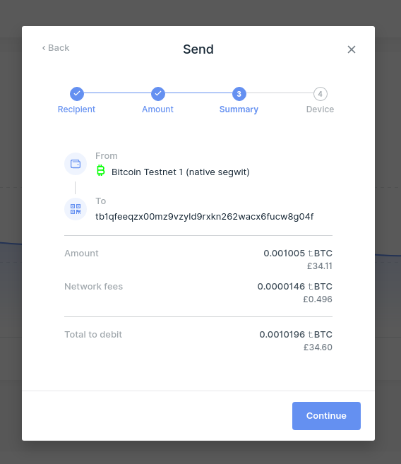
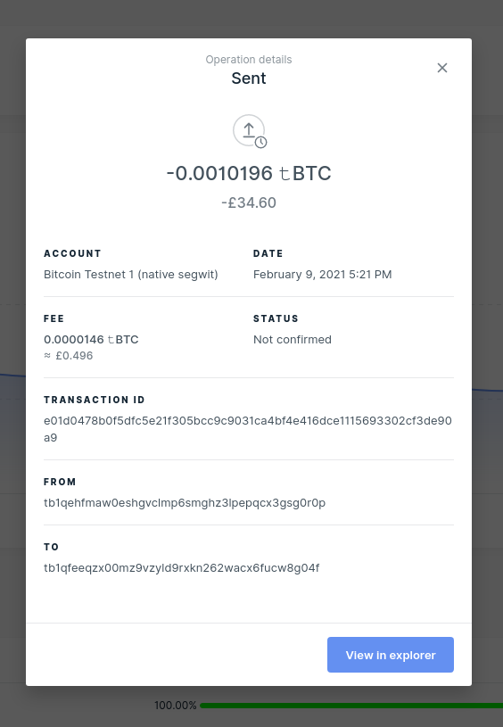

# Issue PolkaBTC

PolkaBTC allows you to receive a representation of BTC to be used any way you see fit in the Polkadot ecosystem.
To get you started, follow this guide.

At the end of this guide you will have:

- [x] Locked BTC with a collateralized Vault
- [x] Issued your first PolkaBTC on the PolkaBTC app

?> _TODO_ Add the video here.

## Prerequisites

Make sure you have the required [polkadot-js extension and a Bitcoin wallet](start/prereq.md).

## Issue PolkaBTC

### 1. Go to [ rococo.polkabtc.io](https://rococo.polkabtc.io/app)

The Issue page displays your current PolkaBTC and DOT balances. In addition, a table shows all of your ongoing/pending Issue requests.

### 2. Enter the amount of PolkaBTC you want to issue in the app

?> Don't forget to get some testnet DOT via the faucet ("Request DOT" button, right side of top bar) before making an issue request. You will need this to pay for parachain transaction fees.

Enter the amount of PolkaBTC you want to issue. The app will automatically select a vault for you. Click **"Confirm"**.

Sign the transaction via the `polkadot-js` extension when asked and wait a few moments.

### 3. Transfer BTC from your Bitcoin wallet to the given address

Use your Bitcoin wallet to transfer the specified `amount` to the given `address`.

?> This final amount will include a small system fee on top of the original amount specified.

Once the payment has been sent, the app will automatically locate your transaction on Bitcoin.
If your transaction is included and has sufficient confirmations, a button to finalize the issue process will render in the table.

Click on the **"Execute"** button to finalize the Issue process and claim your PolkaBTC.

#### Ledger

To configure [Ledger Live](https://www.ledger.com/ledger-live) to work with Bitcoin testnet, go to `Setting` > `Experimental features` and enable `Developer mode`. Using the `Manager`, install the `Bitcoin testnet` app onto your device.

Enter the recipient address or scan the QR code. ([Support](https://support.ledger.com/hc/en-us/articles/360019123593-Send-crypto-assets))

Enter the amount - this may be auto-completed.

Review the summary and click **"Continue"**.

Confirm the recipient address, amount and fees on the device.

The receipt will show the transaction ID, click **"View in explorer"** to check whether your transaction is included in the Bitcoin network.

#### Trezor

To configure the [Trezor Wallet](https://wallet.trezor.io/#/) to work with Bitcoin testnet, go to the `Wallet Settings` and set `Backend Server URL` to `https://tbtc2.trezor.io`.

For up-to-date details please checkout the [Trezor Wiki](https://wiki.trezor.io/Bitcoin_testnet).

Enter the recipient address and amount manually or scan the QR code. ([User Manual](https://wiki.trezor.io/User_manual:Making_payments#Enter_the_destination_address_and_the_amount))

Confirm the recipient address, amount and fees on the device.

The payment will appear in the `Transactions` tab as unconfirmed. Once this is included in the Bitcoin network the status should update.
If configured, you may also check the status of the transaction in a block explorer.

